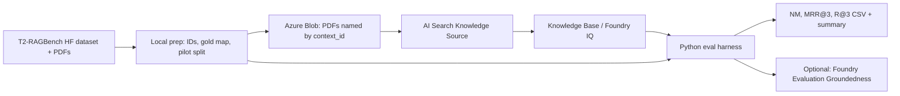

# Plan: Evaluate Foundry IQ on T²-RAGBench (NM + MRR@3)

**Date:** 2026-07-24  
**Goal:** Run Foundry IQ (agentic Knowledge Base retrieval) against [T²-RAGBench](https://huggingface.co/datasets/G4KMU/t2-ragbench) and produce leaderboard-comparable **Number Match (NM)** and **MRR@3** (plus R@3), using Microsoft Foundry + Azure AI Search.

## Problem frame

Your existing FoundryIQ module (`src/foundry_rag/mechanisms/foundryiq.py`) calls a provisioned Knowledge Base via `KnowledgeBaseRetrievalClient` with `ANSWER_SYNTHESIS`. It does **not** yet:

1. Ingest T²-RAGBench PDFs / contexts into a Knowledge Source  
2. Map retrieval citations back to gold `context_id` / `file_name`  
3. Score answers with T²-RAGBench **Number Match** (ε = 1e−2)  
4. Produce a leaderboard-style table (per subset NM, MRR@3, weighted avg)

Built-in Foundry evaluators (Groundedness, Document Retrieval / NDCG) are useful **add-ons**, but they do **not** replace T²-RAGBench NM / MRR@3. Custom scoring is required for leaderboard parity.

## Recommended architecture



**Query path (system under test):** Foundry IQ Knowledge Base retrieve (`ANSWER_SYNTHESIS`) — same pattern as `retrieve_foundryiq`.  
**Optional path:** Foundry Agent + Knowledge Base tool (portal playground / Agent Service) — same KB underneath; keep primary scoring against the KB API for reproducibility.

**Language:** Python (matches this repo).  
**Auth:** `DefaultAzureCredential` / managed identity (no keys in code).

## Key design decisions

| Decision | Recommendation | Why |
|----------|-----------------|-----|
| Corpus form | **PDFs in Blob** (primary); extracted `context` JSON as optional ablation | Matches real Foundry IQ doc RAG; T²-RAGBench ships PDFs |
| Document identity | Blob path / metadata = stable `context_id` or `file_name` | Required to compute MRR@3 against gold |
| Eval metrics | **Custom NM + MRR@3 + R@3** first; Foundry evaluators second | Leaderboard parity |
| Scope (phase 1) | **Pilot:** FinQA `test` sample (e.g. 50–100 Qs) | Cost/latency control before full ~23k |
| Oracle baseline | Same generator model with gold `context` injected | Separates retrieval vs reasoning ceiling |
| Generator | Foundry chat deployment used by KB answer synthesis (or explicit agent model) | Must be recorded on results for fair comparison |

### Critical risk: citation → gold ID mapping

MRR@3 only works if each retrieved chunk/citation can be mapped to a gold document ID.

**Plan requirement:** when uploading blobs, use deterministic names, e.g.:

`t2rag/{subset}/{context_id}/{file_name}.pdf`

and ensure Knowledge Source / index preserves `metadata_storage_path` or a custom `context_id` field. The harness then maps citation URLs / source refs → `context_id`.

If agentic retrieval only returns opaque chunk IDs, parse `include_activity=True` activity traces and/or index `metadata_storage_name` — validate this on the 50-question pilot before scaling.

---

## Phased steps

### Phase 0 — Prerequisites (Foundry + Search)

#### Phase 0 status (2026-07-25)

| Item | Status | Notes |
|------|--------|-------|
| Subscription | Done | `ab031c7f-87a9-41c0-87af-9c45f5a9d571` (Azure subscription 1) |
| Foundry project | Done | `https://foundry-rag-resource.services.ai.azure.com/api/projects/foundry-rag` |
| Chat deployment | Done | `gpt-5-mini` |
| Embedding deployment | Done | `text-embedding-3-small` |
| Search for Foundry IQ | Done (endpoint switched) | Use **`foundryiq-knowledge-resource`** (SKU **Standard**, Central US, semantic standard). Not Free-tier `foundry-rag-ai-search-service`. |
| Knowledge bases on Search | Empty | `GET /knowledgebases` → `[]` — create in Phase 2 |
| Search managed identity | Done | SystemAssigned `ce1b0fbf-dead-4db0-a480-5be39b359199` |
| Storage account | Done | `foudryragstorageacct` in `Foundry-Rag-RG` (Central US); container `t2-ragbench` |
| Search MI → Blob | Done | Storage Blob Data Reader on storage account |
| Search MI → Foundry | Done | Cognitive Services User on `foundry-rag-resource` |
| User → Blob upload | Done | Storage Blob Data Contributor for signed-in user |
| `.env` Foundry + Search + Storage | Done | Points at Standard Search; KB/KS names reserved; storage set |
| Foundry connection name | Done | Use existing tool connection `foundryiqknowledgerespce44` (Standard Search). |

1. Confirm Foundry project (`FOUNDRY_PROJECT_ENDPOINT`) and deployments:
   - Chat model (KB answer synthesis / agent)
   - Embedding model (vectorizer for knowledge source)
2. Confirm Azure AI Search service that supports **agentic retrieval / Knowledge Bases** (`AZURE_AI_SEARCH_ENDPOINT`).
3. Storage account + container for T²-RAGBench PDFs.
4. RBAC (managed identity preferred):
   - Search → Blob (read)
   - Search → Foundry embeddings
   - Your principal / harness → Search Knowledge Base retrieve
   - Harness → Blob (upload)
5. Set env (extend `.env` from `.env.example`):
   - `AZURE_AI_SEARCH_KNOWLEDGE_BASE=t2-ragbench-kb` (new)
   - knowledge source name(s) for T² corpus

**Exit criteria:** playground or one-shot `retrieve_foundryiq`-style call works against an empty/small test KS.

**Remaining Phase 0 actions (need your OK to provision):**

1. Enable system-assigned MI on `foundryiq-knowledge-resource`.
2. Create storage account + container `t2-ragbench` (recommend `compound-rag-rg-ncus`, Central US to match Search).
3. RBAC: Search MI → Storage Blob Data Reader; Search MI → Cognitive Services User on `foundry-rag-resource`; user → Search Service Contributor / Index Data Contributor.
4. Add Foundry project connection to Standard Search (if missing); update `AZURE_AI_SEARCH_CONNECTION_NAME`.

### Phase 1 — Dataset prep (local)

#### Phase 1 status (2026-07-25)

| Item | Status | Notes |
|------|--------|-------|
| FinQA test load | Done | via `datasets` (`G4KMU/t2-ragbench`) |
| Pilot sample | Done | N=50, seed=42 → 50 questions, **48 unique PDFs** |
| `pilot.jsonl` / `gold_docs.json` / `oracle_contexts.jsonl` | Done | under `data/t2_ragbench/` |
| Local PDFs | Done | `data/t2_ragbench/pdfs/FinQA/<context_id>/` (~11 MB) |
| Prep script | Done | `scripts/prep_t2_ragbench_pilot.py` |

HF PDF layout for FinQA: `data/FinQA/{split}/pdf/...` (not `data/FinQA/pdf/...`).

1. Download `G4KMU/t2-ragbench` (HF `datasets`) + clone PDFs from the dataset repo `data/` tree.
2. Build a local eval table per subset/split:
   - `id`, `question`, `program_answer`, `context_id`, `file_name`, `subset`, `split`
3. Build gold retrieval map: `question_id → context_id` (and optional `file_name`).
4. Choose pilot set: FinQA `test`, stratified sample (start **N=50**, then 200, then full test).
5. Optional Oracle table: same questions + gold `context` text for Oracle NM baseline.

**Artifacts:** `data/t2_ragbench/pilot.jsonl`, `gold_docs.json`, `oracle_contexts.jsonl`

**Reproduce:**

```bash
uv run python scripts/prep_t2_ragbench_pilot.py --subset FinQA --split test --n 50 --seed 42
```

### Phase 2 — Ingest into Foundry IQ

#### Phase 2 status (2026-07-25)

| Item | Status | Notes |
|------|--------|-------|
| Upload pilot PDFs | Done | 48 blobs → `foudryragstorageacct` / `t2-ragbench` |
| Blob path layout | Done | `t2rag/FinQA/{context_id}/{page_*.pdf}` |
| Manifest | Done | `data/t2_ragbench/blob_manifest.json` |
| Upload script | Done | `scripts/upload_t2_ragbench_pdfs.py` |
| Knowledge source + KB | **Next** | Create in Foundry portal (or REST) against Standard Search |

```bash
uv run python scripts/upload_t2_ragbench_pdfs.py
```

1. Upload pilot PDFs to Blob with stable paths/IDs.
2. In **Foundry (new)** → Knowledge, **or** programmatically:
   - Create **Azure Blob knowledge source** (indexed) with Foundry embedding vectorizer  
   - Create **Knowledge Base** referencing that source  
   - Configure answer synthesis + medium reasoning effort (align with current `foundryiq.py`)
3. Run indexer; verify document count ≈ unique `context_id`s in pilot.
4. Spot-check portal playground: ask 3 known FinQA questions; confirm citations point at expected PDFs.

**Exit criteria:** citations resolve to `context_id` / filename in harness logs.

**Portal next (Knowledge Source + KB):**

1. Foundry → project `foundry-rag` → **Knowledge** → **Knowledge bases** → **+ New**
2. Add knowledge source type **Azure Blob (Indexed)**
3. Storage: `foudryragstorageacct`, container `t2-ragbench`, path prefix optional `t2rag/`
4. Auth: managed identity
5. Vectorizer: Foundry embedding deployment `text-embedding-3-small`
6. Name source `t2-ragbench-ks`, KB `t2-ragbench-kb`
7. Answer model: `gpt-5-mini`; medium retrieval reasoning effort
8. Run indexer; confirm ~48 documents indexed

### Phase 3 — Eval harness (repo work)

Extend the existing FoundryIQ path rather than inventing a second stack.

| Piece | Suggested location |
|-------|--------------------|
| Dataset loader | `src/foundry_rag/eval/t2_ragbench/load.py` |
| Number Match (ε=1e−2) | `src/foundry_rag/eval/t2_ragbench/metrics.py` |
| MRR@k / R@k | same |
| Foundry IQ runner (reuse client) | wrap `mechanisms/foundryiq.py` → return `{answer, ranked_context_ids}` |
| Oracle runner | Foundry chat with gold context only |
| CLI | `scripts/eval_foundryiq_t2_ragbench.py` |
| Results | `data/t2_ragbench/results/{run_id}.jsonl` + `summary.csv` |

**Per-question loop:**

1. Call KB `retrieve` with context-independent `question`  
2. Extract synthesized answer text  
3. Extract ranked retrieved source IDs (top-3) from response/activity/citations  
4. Score NM vs `program_answer`  
5. Score MRR@3 / R@3 vs gold `context_id`  
6. Persist raw response for debugging  

**Output columns (leaderboard-like):**

`subset | NM | MRR@3 | R@3 | n | model | method | run_id`

Methods to report:

- `Oracle Context` (no retrieval)  
- `FoundryIQ / Knowledge Base` (system under test)  
- Optional later: Hybrid BM25 custom index (your module 02) for apples-to-apples vs paper  

### Phase 4 — Scale & report

1. Scale pilot → FinQA full `test` → ConvFinQA `turn_0` → TAT-DQA `test`.  
2. Produce summary table matching leaderboard shape (NM + MRR@3 per subset + weighted avg by #QA).  
3. Optional: log runs to Foundry Evaluation with Groundedness / Document Retrieval for qualitative dashboards — **do not replace** NM/MRR.  
4. Cost/latency report: tokens, Search RU, $/question, p50/p95 latency.

### Phase 5 — Hardening (after metrics work)

1. Resume failed runs (idempotent JSONL append).  
2. Rate limiting / concurrency caps.  
3. Ablations: extracted-text KS vs PDF KS; medium vs low reasoning effort; with/without answer synthesis (extractive then local LLM).  

---

## What “same metrics” means (implementation contract)

**Number Match (NM)**  
Parse numeric prediction from model answer; compare to `program_answer` with relative tolerance **ε = 1e−2**. Non-numeric → incorrect.

**MRR@3**  
If gold `context_id` at rank `r` in top-3 retrieved docs → `1/r`, else `0`. Average over questions.

**R@3**  
`1` if gold in top-3, else `0`. Average over questions.

**Oracle**  
MRR@3 / R@3 = 100 by definition; NM is reasoning ceiling for the chosen generator.

---

## Effort & cost expectations

| Stage | Rough effort | Cost note |
|-------|--------------|-----------|
| Phase 0–1 | 0.5–1 day | Low |
| Phase 2 ingest + ID validation | 1–2 days | Indexing + embeddings |
| Phase 3 harness + pilot 50 | 1–2 days | ~50 KB retrieve+synthesize calls |
| Full FinQA test (~1.1k) | 0.5–1 day run time | Dominant cost: answer synthesis |
| All subsets (~23k) | multi-day / high $ | Prefer sample → full |

Full 23k with answer synthesis is expensive; treat as Phase 4 only after pilot metrics look sane.

---

## Out of scope (unless requested)

- Submitting to public T²-RAGBench leaderboard  
- Retraining / fine-tuning models  
- Replacing Foundry IQ with custom Hybrid RAG as primary SUT (optional comparison only)  
- Exact replication of paper embedding ablations  

---

## Success criteria

1. Pilot (N≥50 FinQA test) produces NM, MRR@3, R@3 for Foundry IQ and Oracle.  
2. Citation → `context_id` mapping validated (spot-check ≥90% of hits).  
3. One-command CLI reproduces summary CSV from a saved run.  
4. Documented env + portal steps so the KB can be recreated in another Foundry project.

---

## Implementation units (when executing)

1. **Dataset prep scripts** — download, ID map, pilot JSONL  
2. **Blob upload + KS/KB provisioning notes** (portal checklist + optional Python)  
3. **Metrics module** — NM, MRR@k, R@k + unit tests on paper-style examples  
4. **Foundry IQ adapter** — extend `foundryiq.py` to return ranked source IDs  
5. **Eval CLI** — batch run, resume, summary table  
6. **Docs** — update `docs/rag/09_foundryiq.md` with T²-RAGBench eval section  

### Test scenarios (harness)

- NM: exact match, 1% relative match, mismatch, non-numeric → fail  
- MRR: gold@1 → 1.0; gold@3 → ~0.33; miss → 0  
- End-to-end dry-run: 3 fixture questions with mocked KB response  

---

## Open choices (confirm before build)

1. **Corpus:** PDFs only (recommended) vs extracted `context` text documents?  
2. **Scale:** Pilot 50 → FinQA test only, or commit to all three subsets?  
3. **Query surface:** Knowledge Base API only (recommended for metrics) vs Foundry Agent playground also?  
4. **Existing Search tier:** Does current `foundry-rag-ai-search-service` support Knowledge Bases / agentic retrieval, or do we need a SKU upgrade?
