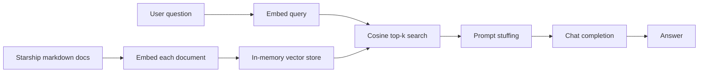

# Naive RAG

**Purpose**

Naive RAG is the baseline retrieval-augmented generation pattern: embed source documents, retrieve the most similar chunks at query time, and pass them to a chat model as context. It demonstrates the minimum viable RAG loop without an external search service. In this repo it runs entirely in memory against the starship travel-agency corpus.

**Problem it solves**

Short user questions often fail to match long documents by keyword overlap alone. Embedding the full document text and ranking by cosine similarity gives a simple semantic match, so questions like "Which ship travels farthest without refueling?" can surface the right ship spec even when the query wording differs from the source.

**How it works**

- Load five starship markdown files from `data/01_naive_rag/`.
- Embed each whole document with the Foundry embedding deployment.
- Store `(id, text, vector)` records in an in-memory cosine-similarity index.
- At query time, embed the user question and return top-k (default 3) matches.
- Build a user prompt that lists retrieved documents plus the question.
- Call the chat model with a selectable system prompt (default, kid-friendly, or marketing) and return the answer.

**Figure**



**When to use it**

Use naive RAG to validate embeddings, prompts, and end-to-end wiring before adding Azure AI Search. It fits small, static corpora that fit in memory and do not need BM25 keyword recall or managed index features.

**Run**

```bash
uv run python scripts/run_01_naive_rag.py
```

**Data**

`data/01_naive_rag/` — five per-ship markdown files (`aurora-class.md`, `ion-drive-clipper.md`, `nebula-class.md`, `quantum-fold-starliner.md`, `starlance-explorer.md`).
