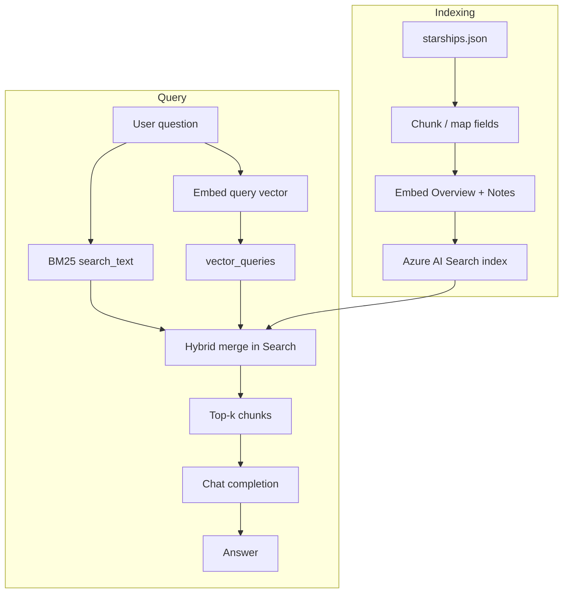

# Hybrid RAG

**Purpose**

Hybrid RAG combines lexical (BM25) and vector (cosine `exhaustiveKnn`) search in Azure AI Search so retrieval benefits from both exact term matches and semantic similarity. The reference module indexes structured starship records with separate text and vector fields, then queries both channels in a single hybrid request.

**Problem it solves**

Pure vector search can miss rare proper nouns, model numbers, or exact field values (for example a specific fuel type or seat count). Pure keyword search misses paraphrased intent. Hybrid retrieval merges both signals so technical specs and natural-language questions both surface relevant starship chunks.

**How it works**

- Build an Azure AI Search index from `data/02_hybrid_rag/index_definition.json` (BM25 + `exhaustiveKnn` vector profile, 1536-dim vectors on `OverviewVector` and `NotesVector`).
- Ingest `starships.json`: chunk or field-map records, embed overview/notes, upload documents.
- At query time, call `SearchClient.search()` with both `search_text` (BM25) and `vector_queries` (hybrid mode).
- Take top results, assemble context from retrieved fields, and generate an answer with the chat model.

**Figure**



**When to use it**

Use hybrid RAG when you have a managed search index, mixed structured and unstructured fields, and need better recall than in-memory vector search alone.

**Run**

```bash
uv run python scripts/run_02_hybrid_rag.py
```

**Data**

`data/02_hybrid_rag/` — `starships.json` (module-specific, larger copy) and `index_definition.json`.
