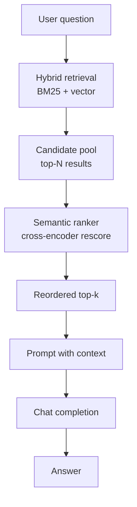

# Re-Ranking RAG

**Purpose**

Re-ranking RAG runs the same hybrid BM25 + vector retrieval as module 02, then applies Azure AI Search semantic ranking (a cross-encoder-style reranker) to reorder candidates by deeper semantic relevance. The index includes a `semantic` configuration with prioritized title, content, and keyword fields.

**Problem it solves**

Hybrid search can return plausible but wrong chunks in the top positions when many documents share overlapping vocabulary (ship names, fuel types, speed claims). Semantic ranking re-scores the candidate set so the most contextually relevant passages rise above superficial keyword or embedding matches.

**How it works**

- Use the `starships-index-semantic` index defined in `data/03_reranking_rag/index_definition.json` (hybrid vector profile + `default_semantic_config`).
- Ingest `starships.json` with the same field/vector layout as the hybrid module.
- Issue a hybrid search with `query_type="semantic"` and the semantic configuration enabled.
- Azure AI Search returns results ordered by boosted reranker score instead of raw hybrid score alone.
- Pass reranked chunks to the chat model for answer generation.

**Figure**



**When to use it**

Add reranking when hybrid top-k is directionally right but ordering is noisy, especially on dense corpora with similar entities. Compare side by side with module 02 to see score and rank changes on the same question.

**Run**

```bash
uv run python scripts/run_03_reranking_rag.py
```

**Data**

`data/03_reranking_rag/` — `starships.json` and `index_definition.json` (semantic ranking configuration; not interchangeable with other modules' index definitions).
