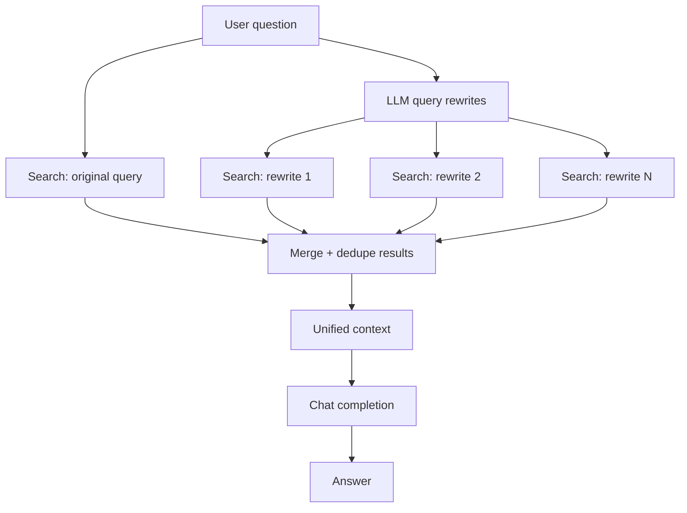

# Multi-Query RAG

**Purpose**

Multi-query RAG expands a single user question into several query rewrites, runs hybrid search for each, then merges and deduplicates results before generation. The reference combines LLM-generated rewrites with Azure AI Search semantic query-rewrite support on an index configured for that feature.

**Problem it solves**

One phrasing of a question may not align with how facts are written in the index. A user asking "fastest cruiser" might miss a document that says "top speed" or uses a product codename. Multiple rewrites broaden recall without requiring the user to manually rephrase.

**How it works**

- Build the `starships-index-semantic-query-rewrite` index from `data/04_multiquery_rag/index_definition.json` (semantic config + integrated vectorizer).
- Ingest `starships.json` into the index.
- At query time, use the chat model to generate N alternative phrasings of the user question.
- Run hybrid search for the original query and each rewrite (leveraging Search semantic query rewrite where configured).
- Merge, deduplicate, and rank combined hits into a single context set.
- Generate the final answer from the merged retrieval set.

**Figure**



**When to use it**

Use multi-query when recall is the bottleneck and users ask short, ambiguous questions against a varied document style. Inspect logged rewrites to confirm they are distinct and actually retrieve new chunks. Cost scales with the number of searches per question.

**Run**

```bash
uv run python scripts/run_04_multiquery_rag.py
```

**Data**

`data/04_multiquery_rag/` — `starships.json` and `index_definition.json` (semantic query-rewrite index; distinct from modules 02, 03, and 05).
