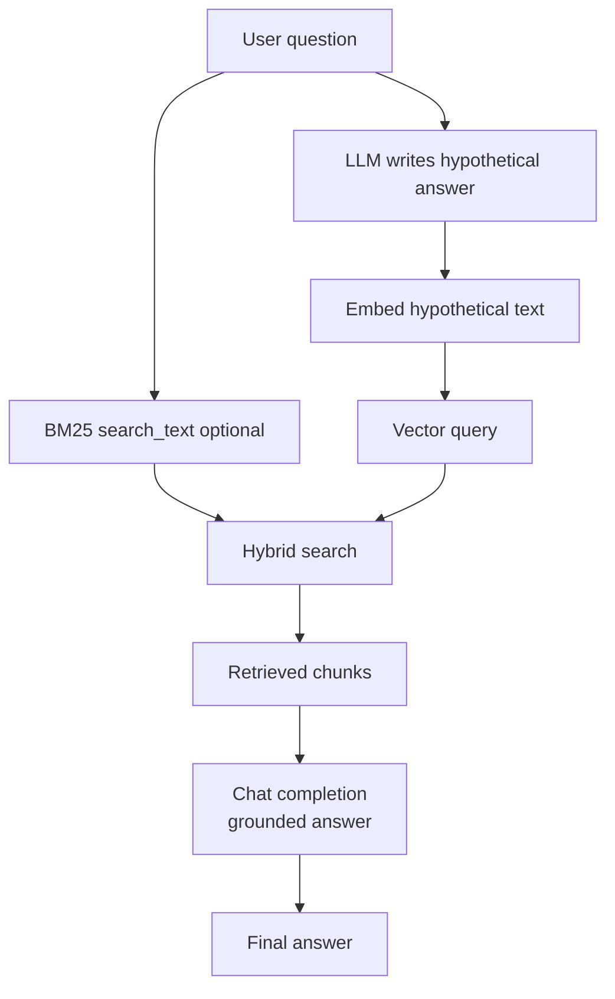

# HyDE RAG

**Purpose**

HyDE (Hypothetical Document Embeddings) asks the chat model to write a short hypothetical answer to the user question, embeds that synthetic passage, and uses it as the vector query against the search index. Lexical search can still run on the original question while the vector leg follows the hypothetical document's semantics.

**Problem it solves**

Short questions produce weak embedding vectors that sit far from the embedding space of longer, factual source text. A one-line question about fuel type may not neighbor the paragraph that actually states the spec. A hypothetical answer written in document style lands closer to real indexed content, improving vector recall.

**How it works**

- Use the `starships-index-hyde-vector-semantic` index from `data/05_hyde_rag/index_definition.json`.
- Ingest `starships.json` with overview/notes vectors as in the hybrid modules.
- On query: prompt the chat model to produce a plausible hypothetical answer (not shown to the user as the final response).
- Embed the hypothetical answer and pass it as the `vector_queries` payload.
- Optionally keep `search_text` on the original question for BM25 hybrid recall.
- Retrieve top chunks, then generate the real grounded answer from retrieved context.

**Figure**



**When to use it**

Try HyDE when vector retrieval underperforms on terse questions but keyword search is acceptable, or when documents are long-form prose and queries are conversational. Compare the hypothetical passage to the final answer — they should differ in grounding and style. HyDE adds an extra LLM call per query.

**Run**

```bash
uv run python scripts/run_05_hyde_rag.py
```

**Data**

`data/05_hyde_rag/` — `starships.json` and `index_definition.json` (HyDE-specific semantic index name).
