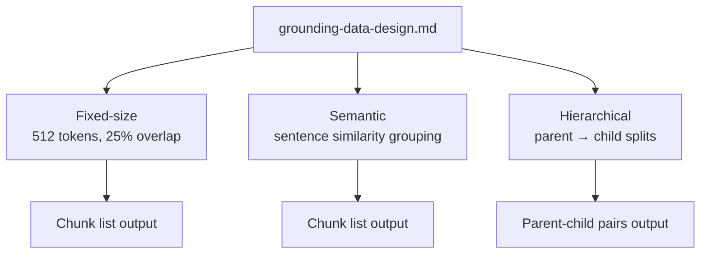

# Chunking Strategies

**Purpose**

Chunking strategies control how long documents are split before embedding and indexing. This module compares three approaches from the reference repo — fixed-size token windows, embedding-based semantic grouping, and hierarchical parent-child structure — on the same grounding-data article so you can see how chunk boundaries affect downstream retrieval.

**Problem it solves**

Whole-document embedding dilutes relevance when only one section answers the question. Naive character splits break mid-sentence and separate related facts. Poor chunk boundaries cause retrieval to return incomplete or misleading context even when the source document contains the answer.

**How it works**

- Load `grounding-data-design.md` from `data/06_chunking_strategies/`.
- **Fixed-size:** tokenize with `cl100k_base`, chunk at 512 tokens with 25% overlap (`FixedSizeChunker`).
- **Semantic:** split into sentences, group consecutive sentences while embedding similarity stays above 0.75, cap at 512 tokens per chunk (`SemanticChunker`).
- **Hierarchical:** build larger parent groups (up to 1024 tokens), then subdivide each parent into smaller child chunks (up to 256 tokens) for fine-grained retrieval with parent context (`HierarchicalChunker`).
- Interactive CLI prints chunk panels for side-by-side comparison; no search index or answer generation in this module.

**Figure**



**When to use it**

Run this before building search indexes for modules 02–05 and 07. Pick fixed chunks for uniform latency and predictable sizes; semantic chunks when sections have natural topic boundaries; hierarchical when you need small retrieval units with broader parent context for generation or display.

**Run**

```bash
uv run python scripts/run_06_chunking_strategies.py
```

**Data**

`data/06_chunking_strategies/` — `grounding-data-design.md` (Azure grounding-data design article; same file also used by module 08).
