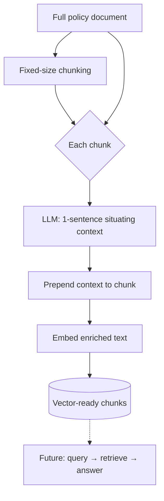

# Contextual Retrieval

**Purpose**

Contextual retrieval prepends a one-sentence situating context to each chunk before embedding, following the Anthropic contextual-retrieval pattern ported from the reference module. The LLM reads the full document plus the chunk and produces a short line that captures entities, subject, IDs, and references so isolated chunks remain searchable.

**Problem it solves**

Fixed-size chunks lose document-level context when embedded alone. A chunk that says "employees may request up to two days per month" is ambiguous without knowing it belongs to a remote-work policy, which team it applies to, or what document version it is. Vector and keyword search both struggle on decontextualized fragments.

**How it works**

- Load `remote_work_policy_pl.md` from `data/07_contextual_retrieval/`.
- Split the document with `FixedSizeChunker` (512 tokens, 25% overlap).
- For each chunk, call the chat model with the reference prompt: full document + chunk in, one-sentence context out (no preamble).
- Concatenate `context + chunk` into enriched text.
- Embed enriched text with the Foundry embedding deployment.
- CLI displays context, original chunk, and embedding dimension per chunk (indexing demo; retrieval loop lands in later phases).

**Figure**



**When to use it**

Apply contextual enrichment at index time for long policies, manuals, or contracts where chunks are syntactically fine but semantically orphaned. Cost is one LLM call per chunk at ingestion; use `--max-chunks` for smoke tests. Pair with hybrid search (modules 02–05) once an index consumes these enriched vectors.

**Run**

```bash
uv run python scripts/run_07_contextual_retrieval.py
```

**Data**

`data/07_contextual_retrieval/` — `remote_work_policy_pl.md` (remote work policy; not the starship corpus).
