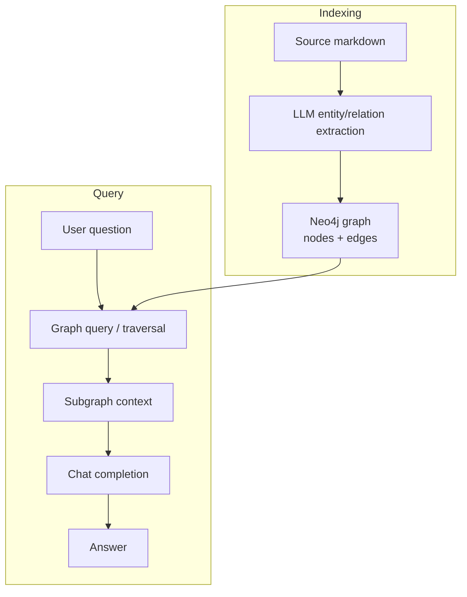

# GraphRAG

**Purpose**

GraphRAG extracts entities and relationships from source documents with an LLM, loads them into a Neo4j knowledge graph, and answers questions by traversing graph structure rather than (or in addition to) vector similarity alone. The reference module targets relational questions — dependencies, hierarchies, and cross-entity facts — that flat chunk retrieval handles poorly.

**Problem it solves**

Vector RAG retrieves similar text but does not reliably connect facts across documents or follow multi-hop relationships. Questions like "which components depend on X and who owns Y?" need explicit entity links. GraphRAG materializes those links so queries can walk paths instead of hoping co-occurrence appears in one chunk.

**How it works**

- Ingest `grounding-data-design.md` from `data/08_graphrag/` (same article as module 06).
- LLM extraction pass: prompt with fixed JSON schema for entities and relations (ported from reference `Prompts.cs`).
- Write nodes and edges to Neo4j via the Python driver (`GraphDb` port).
- At query time, map the user question to graph traversal / aggregation logic (`KnowledgeGraphAggregator` port).
- Collect subgraph context (entities, paths, neighboring facts) and pass to the chat model for the final answer.
- Requires local or remote Neo4j (`NEO4J_URI`, `NEO4J_USER`, `NEO4J_PASSWORD`).

**Figure**



**When to use it**

Use GraphRAG when your corpus has rich entity relationships and users ask multi-hop or structural questions. It adds ingestion complexity (extraction quality, graph schema, Neo4j ops) compared to search-index RAG. Validate with Cypher counts (`MATCH` node/edge totals) before trusting answers.

**Run**

```bash
uv run python scripts/run_08_graphrag.py
```

**Data**

`data/08_graphrag/` — `grounding-data-design.md`.
