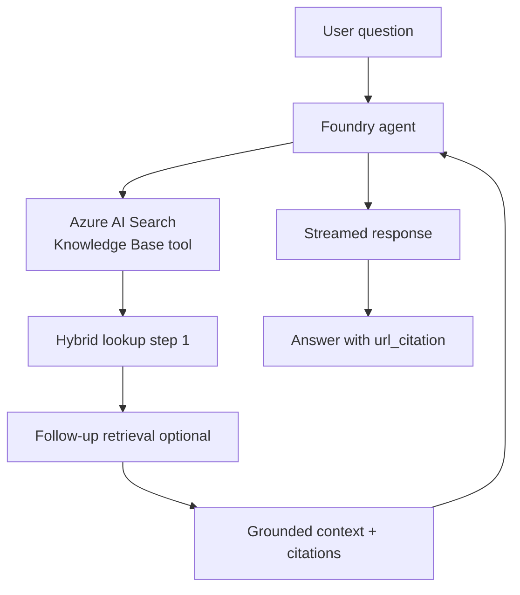

# FoundryIQ

**Purpose**

FoundryIQ demonstrates agentic retrieval through Microsoft Foundry: a project agent wired to Azure AI Search Knowledge Base resources performs multi-step hybrid lookup and returns answers with citations. Unlike modules 01–02, this path uses the Foundry agent + `AzureAISearchToolDefinition` pattern rather than hand-rolled `SearchClient.search()` calls in application code.

**Problem it solves**

Single-shot retrieval often fails on complex questions that need multiple lookups, field filters, or iterative refinement. Hand-building that orchestration in every app is repetitive. FoundryIQ delegates retrieval planning to the agent runtime against a provisioned Knowledge Base, surfacing `url_citation` annotations on streamed responses.

**How it works**

- Resolve the Azure AI Search connection from the Foundry project (`connections.get`).
- Create an agent with `AzureAISearchToolDefinition` and `AzureAISearchToolResource` pointing at Knowledge Base / index resources (`query_type=HYBRID`).
- Query via `project_client.get_openai_client().responses.create(...)` (streaming).
- Agent performs multi-step retrieval over the configured knowledge sources.
- Stream tokens and citation annotations back to the CLI.
- Clean up agent and tool resources after the session (context-manager pattern from the Foundry SDK reference).

**Figure**



**When to use it**

Use FoundryIQ when you already have Azure AI Search Knowledge Bases (for example Contoso cloud, health-plans, or job-roles samples) and want Foundry-managed agentic retrieval instead of custom search orchestration. This module does not ship synthetic starship documents; you point at a provisioned Knowledge Base in your Foundry project.

**Run**

```bash
uv run python scripts/run_09_foundryiq.py
```

**Data**

No local `data/09_foundryiq/` corpus — the reference repo has no `Data/` folder. Retrieval targets Azure AI Search Knowledge Bases configured in your Foundry project, not files in this repository.
